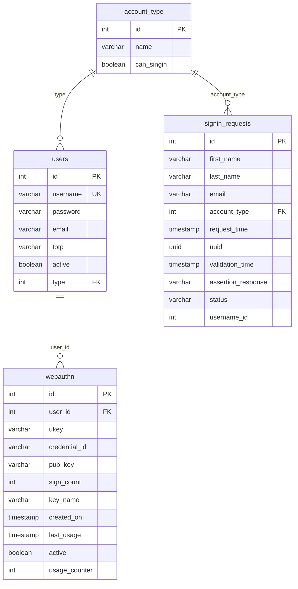

```mermaid
erDiagram
    account_type {
        int id PK
        varchar name
        boolean can_singin
    }
    users {
        int id PK
        varchar username UK
        varchar password
        varchar email
        varchar totp
        boolean active
        int type FK
    }
    webauthn {
        int id PK
        int user_id FK
        varchar ukey
        varchar credential_id
        varchar pub_key
        int sign_count
        varchar key_name
        timestamp created_on
        timestamp last_usage
        boolean active
        int usage_counter
    }
    signin_requests {
        int id PK
        varchar first_name
        varchar last_name
        varchar email
        int account_type FK
        timestamp request_time
        uuid uuid
        timestamp validation_time
        varchar assertion_response
        varchar status
        int username_id
    }

    account_type ||--o{ users : "type"
    users ||--o{ webauthn : "user_id"
    account_type ||--o{ signin_requests : "account_type"
```