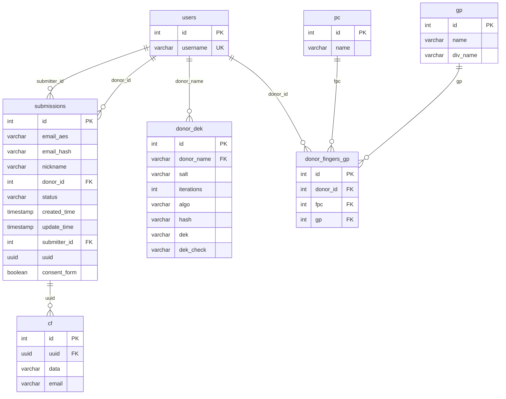

```mermaid
erDiagram
    users {
        int id PK
        varchar username UK
    }
    submissions {
        int id PK
        varchar email_aes
        varchar email_hash
        varchar nickname
        int donor_id FK
        varchar status
        timestamp created_time
        timestamp update_time
        int submitter_id FK
        uuid uuid
        boolean consent_form
    }
    cf {
        int id PK
        uuid uuid FK
        varchar data
        varchar email
    }
    donor_dek {
        int id PK
        varchar donor_name FK
        varchar salt
        int iterations
        varchar algo
        varchar hash
        varchar dek
        varchar dek_check
    }
    pc {
        int id PK
        varchar name
    }
    gp {
        int id PK
        varchar name
        varchar div_name
    }
    donor_fingers_gp {
        int id PK
        int donor_id FK
        int fpc FK
        int gp FK
    }

    users ||--o{ submissions : "submitter_id"
    users ||--o{ submissions : "donor_id"
    submissions ||--o{ cf : "uuid"
    users ||--o{ donor_dek : "donor_name"
    users ||--o{ donor_fingers_gp : "donor_id"
    pc ||--o{ donor_fingers_gp : "fpc"
    gp ||--o{ donor_fingers_gp : "gp"
```