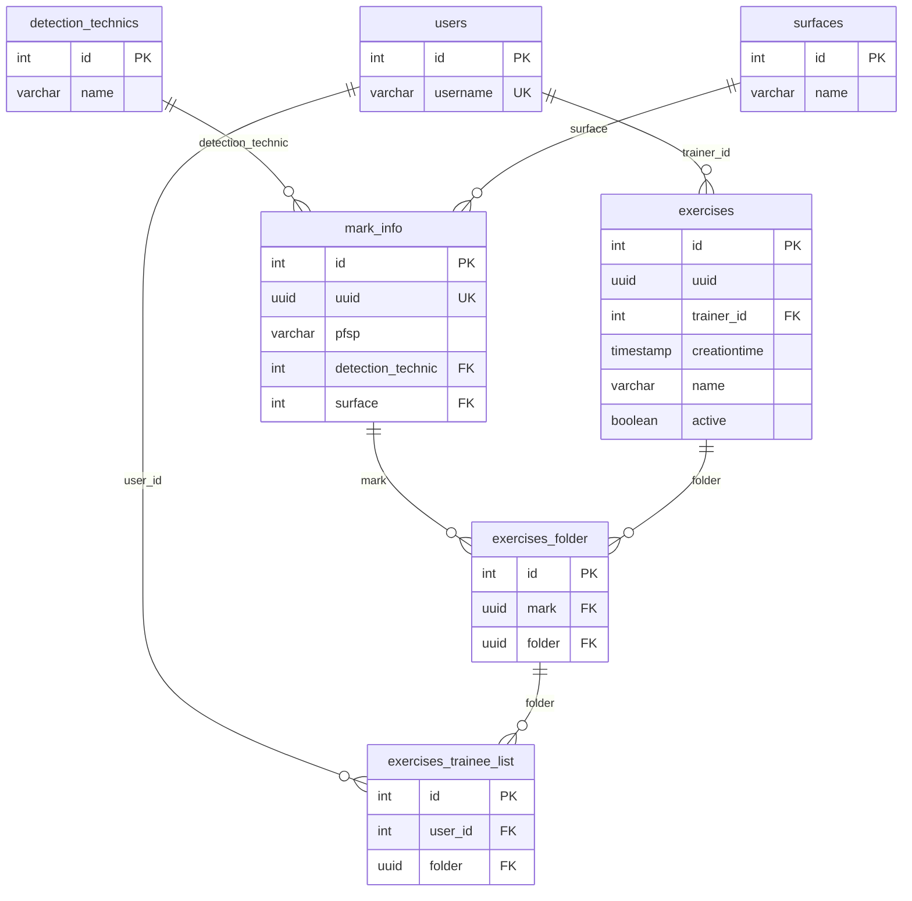

```mermaid
erDiagram
    users {
        int id PK
        varchar username UK
    }
    detection_technics {
        int id PK
        varchar name
    }
    surfaces {
        int id PK
        varchar name
    }
    mark_info {
        int id PK
        uuid uuid UK
        varchar pfsp
        int detection_technic FK
        int surface FK
    }
    exercises {
        int id PK
        uuid uuid
        int trainer_id FK
        timestamp creationtime
        varchar name
        boolean active
    }
    exercises_folder {
        int id PK
        uuid mark FK
        uuid folder FK
    }
    exercises_trainee_list {
        int id PK
        int user_id FK
        uuid folder FK
    }

    detection_technics ||--o{ mark_info : "detection_technic"
    surfaces ||--o{ mark_info : "surface"
    users ||--o{ exercises : "trainer_id"
    mark_info ||--o{ exercises_folder : "mark"
    exercises ||--o{ exercises_folder : "folder"
    users ||--o{ exercises_trainee_list : "user_id"
    exercises_folder ||--o{ exercises_trainee_list : "folder"
```