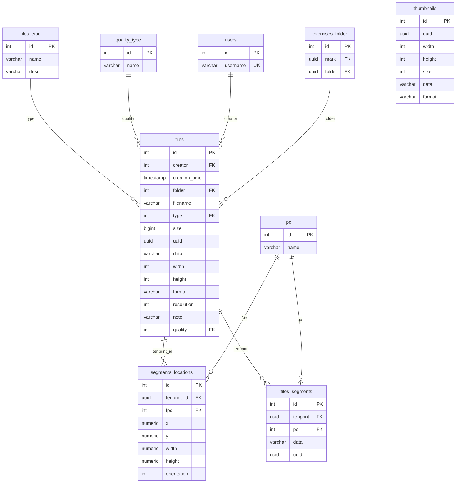

```mermaid
erDiagram
    files_type {
        int id PK
        varchar name
        varchar desc
    }
    quality_type {
        int id PK
        varchar name
    }
    users {
        int id PK
        varchar username UK
    }
    exercises_folder {
        int id PK
        uuid mark FK
        uuid folder FK
    }
    files {
        int id PK
        int creator FK
        timestamp creation_time
        int folder FK
        varchar filename
        int type FK
        bigint size
        uuid uuid
        varchar data
        int width
        int height
        varchar format
        int resolution
        varchar note
        int quality FK
    }
    segments_locations {
        int id PK
        uuid tenprint_id FK
        int fpc FK
        numeric x
        numeric y
        numeric width
        numeric height
        int orientation
    }
    files_segments {
        int id PK
        uuid tenprint FK
        int pc FK
        varchar data
        uuid uuid
    }
    thumbnails {
        int id PK
        uuid uuid
        int width
        int height
        int size
        varchar data
        varchar format
    }
    pc {
        int id PK
        varchar name
    }

    files_type ||--o{ files : "type"
    quality_type ||--o{ files : "quality"
    users ||--o{ files : "creator"
    exercises_folder ||--o{ files : "folder"
    files ||--o{ segments_locations : "tenprint_id"
    pc ||--o{ segments_locations : "fpc"
    files ||--o{ files_segments : "tenprint"
    pc ||--o{ files_segments : "pc"
```