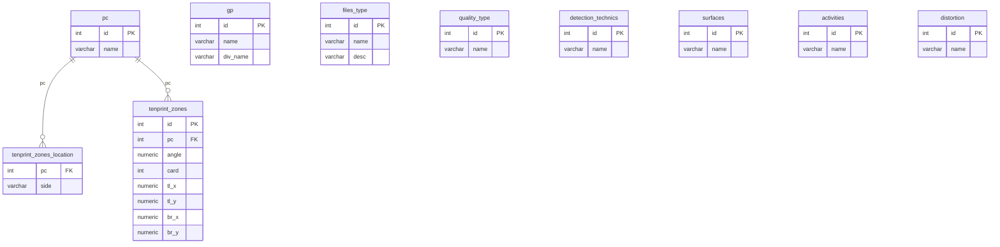

```mermaid
erDiagram
    pc {
        int id PK
        varchar name
    }
    gp {
        int id PK
        varchar name
        varchar div_name
    }
    files_type {
        int id PK
        varchar name
        varchar desc
    }
    quality_type {
        int id PK
        varchar name
    }
    detection_technics {
        int id PK
        varchar name
    }
    surfaces {
        int id PK
        varchar name
    }
    activities {
        int id PK
        varchar name
    }
    distortion {
        int id PK
        varchar name
    }
    tenprint_zones_location {
        int pc FK
        varchar side
    }
    tenprint_zones {
        int id PK
        int pc FK
        numeric angle
        int card
        numeric tl_x
        numeric tl_y
        numeric br_x
        numeric br_y
    }

    pc ||--o{ tenprint_zones_location : "pc"
    pc ||--o{ tenprint_zones : "pc"
```